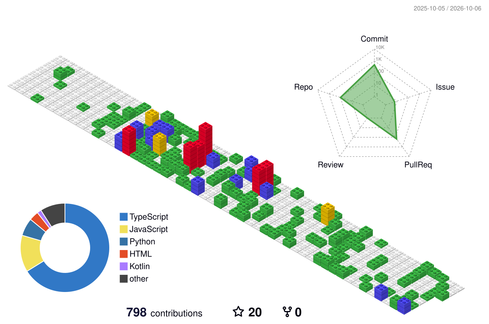

# 👋 Hi there, I'm **Sai Emani**! 

## 🚀 **Aspiring DevOps Engineer**
**Bangalore, India** • [Portfolio](https://sai-emani25.github.io/Portfolio)

---

### 🛠️ **Tech Stack**
| **Cloud** | **Containers** | **CI/CD** | **IaC** | **Languages** | **Monitoring** |
|-----------|----------------|-----------|---------|---------------|----------------|
|  |  |  |  |  |  |
|  |  |  |  |  |  |

### 📊 **GitHub Stats**

### 🌍 **My RPG Contribution World**

### 🚀 **My Projects**

| Project | Description | Type | Difficulty |
|---------|-------------|------|------------|
| [**Project Name 1**](https://github.com/Sai-Emani25/repo1) | Add a brief description of your project here. |  |  |
| [**Project Name 2**](https://github.com/Sai-Emani25/repo2) | Add a brief description of your project here. |  |  |
| [**Project Name 3**](https://github.com/Sai-Emani25/repo3) | Add a brief description of your project here. |  |  |
| [**Project Name 4**](https://github.com/Sai-Emani25/repo4) | Add a brief description of your project here. |  |  |

### 🔥 **Currently Working On**
- 🔄 **AI-powered CI/CD pipelines**
- ☸️ **Kubernetes cluster automation** 
- 🌐 **Multi-cloud deployment strategies**
- 🤖 **ML model deployment pipelines**

### 📫 **Let's Connect!**

---

**⚡ Fun Fact: I automate my coffee machine using GitHub Actions! ☕🚀**

